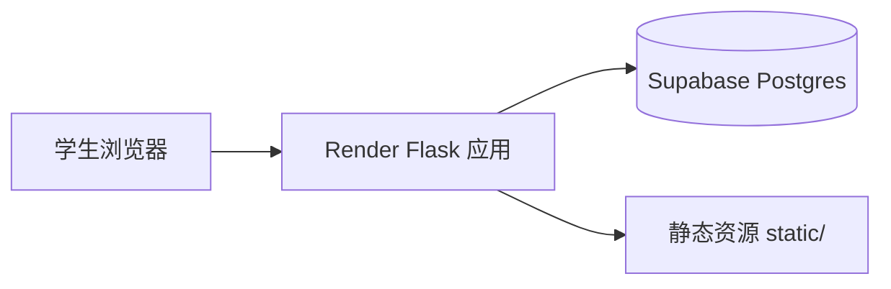
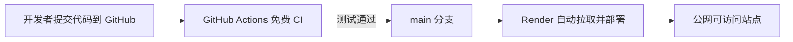
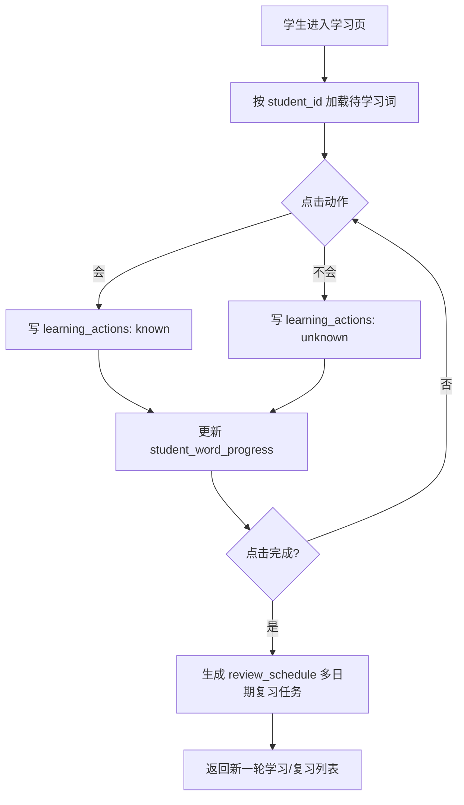

# 纯免费 MVP 方案（中文 + 架构图）

## 1. 你关心的问题，先直接回答

### 1.1 网站部署在哪个 App？
部署在 Render（免费 Web Service）。

原因：
- 你当前是 Flask 动态站点，Render 对 Flask 原生友好。
- 免费层可直接托管 Python Web 服务。
- 支持从 GitHub 自动拉代码并部署。

### 1.2 仍然用 GitHub Actions 还是用外站（免费）？
两者都用，但职责不同：

- 外站（Render + Supabase）负责“运行网站和存数据”。
- GitHub Actions（免费）负责“自动测试/质量门禁”，不是部署主机。

结论：
- 生产运行：外站免费平台。
- 自动化流程：GitHub Actions 免费跑 CI。

### 1.3 功能是否覆盖“学新 + 抗遗忘 + 多学生”？
是，MVP 设计已覆盖三件事：

- 学新：会/不会动作落库并更新学习进度。
- 抗遗忘：按间隔自动生成复习计划。
- 多学生：每个学生独立进度、独立复习计划、互不影响。

## 2. 技术架构（MVP）

### 2.1 组件选型（全部免费层）

- Web 应用：Flask（保留现有模板和路由风格）
- 部署平台：Render Free Web Service
- 数据库：Supabase Free PostgreSQL
- 代码与 CI：GitHub + GitHub Actions Free
- 可选 DNS：Cloudflare Free（仅当你要绑定自定义域名）

### 2.2 核心思路

把当前 data/*.txt 从“在线运行状态存储”改为“初始词库导入源”。

- txt：只用于首批导入词库（seed）
- PostgreSQL：保存所有学习动作和复习计划（持久化）

这样服务重启、部署更新后，学习记录不会丢。

### 2.3 业务功能拆分

#### A. 学新（会/不会）

- 会（known）：记录一次 known 动作，提升掌握度，减少近期再出现概率
- 不会（unknown）：记录一次 unknown 动作，加入近期复习池
- 完成：结束本轮学习，批量生成复习任务

#### B. 抗遗忘复习

沿用你当前规则：
0, 1, 2, 3, 5, 7, 9, 12, 14, 17, 21 天

系统在完成学习后自动插入 review_schedule。

#### C. 多学生

- 每个学生有自己的 student_id
- 所有动作、进度、复习任务都按 student_id 隔离
- 同一个词可被不同学生独立学习、独立统计

## 3. 数据库设计（最小可用）

### 3.1 数据表

1. students
- id
- name
- created_at

2. words
- id
- source_file
- term
- meaning
- language
- created_at

3. learning_actions
- id
- student_id
- word_id
- action_type（known / unknown / complete）
- action_time
- session_id

4. review_schedule
- id
- student_id
- word_id
- review_date
- status（pending / done / skipped）
- source_action_id

5. student_word_progress（推荐）
- student_id
- word_id
- mastery_level
- last_action
- next_review_date
- updated_at

## 4. 架构图（Mermaid）

### 4.1 运行架构图

### 4.2 发布与自动化架构图

### 4.3 学习与复习流程图

## 5. 路由与代码改造建议（最小改动）

保持你当前单路由模式，减少改造成本：

- GET /：按 student_id 渲染词表（学新 + 今日应复习）
- POST / action=check：切换词库/刷新列表
- POST / action=mark_known：写 known 动作
- POST / action=learn：写 unknown + complete，并生成复习计划

新增要求：
- 请求中必须携带 student_id（前期可通过下拉选择学生）
- 所有 SQL 查询都带 student_id 条件

## 6. 部署架构（纯免费）

### 6.1 Render（运行 Flask）

- Build Command：
  pip install -r requirements.txt

- Start Command：
  gunicorn -w 2 -k gthread -b 0.0.0.0:$PORT app:app

- Health Check：
  /

- 环境变量：
  SECRET_KEY
  DATABASE_URL
  DEFAULT_WORD_LIMIT=50
  PYTHON_VERSION=3.11

### 6.2 Supabase（存学习状态）

- 新建免费项目
- 执行建表 SQL（students/words/learning_actions/review_schedule/...）
- 导入现有 txt 词库到 words
- DATABASE_URL 配到 Render

### 6.3 GitHub Actions（CI）

建议工作流：
- push 到 main 时触发
- 安装依赖 + 单元测试 + 轻量 smoke
- 通过后由 Render 自动部署

## 7. 免费层边界与预期

### 7.1 费用
在正常 MVP 使用下可做到 0 成本。

### 7.2 你会遇到的免费层现象
- Render 免费实例会休眠，首次访问有冷启动延迟
- Supabase 免费额度有容量上限
- 小规模教学/个人项目没问题

## 8. MVP 完成标准

以下全部满足即 MVP 可上线：

1. 公网 URL 可访问
2. 学新（会/不会）动作可持久化
3. 抗遗忘复习任务自动生成并可追踪状态
4. 多学生数据彼此隔离
5. 全链路仅使用免费服务
